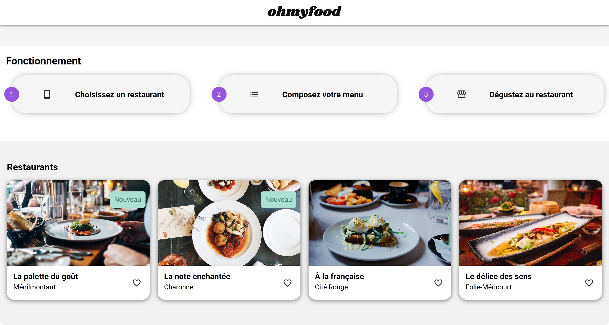

## ohmyfood

  

---

### 📑 Table des matières

* [Mission](#mission)
* [Objectifs](#objectifs)
* [Points forts de l’interface](#points-forts-interface)
* [Stacks techniques](#stacks-techniques)
* [Fonctionnalités et bonnes pratiques](#fonctionnalites-bonnes-pratiques)
* [Aspects techniques & automatisation](#aspects-techniques-automatisation)
* [Points techniques spécifiques](#points-techniques-specifiques)
* [Démo live](#demo-live)

---

### 🎯 Mission

Développer un site web immersif permettant de découvrir les menus de **quatre restaurants parisiens**. Le projet **ohmyfood** démarre par une **animation fluide inspirée des intros de jeux vidéo**, rendant l’expérience utilisateur engageante dès l’arrivée. Le site propose également la **réservation en ligne** et la **personnalisation des menus**, tout en restant responsive et optimisé.

---

### 🧭 Objectifs

* Proposer la découverte de menus interactifs
* Offrir une réservation simple et rapide
* Personnaliser les repas directement via l’interface
* Garantir une expérience fluide sur mobile, tablette et desktop

---

### ✨ Points forts de l’interface

* Menus présentés sous forme de **cartes interactives**
* Fonctionnalité de **réservation en ligne**
* Design **minimaliste et responsive**
* **Animations fluides** pour transitions et interactions

---

### 🛠️ Stacks techniques

| Outils | Fonctions |
|:-------|:---------|
| HTML5 | Structure sémantique des pages |
| CSS3 | Mise en page responsive et animations |
| SASS | Organisation et factorisation des styles |
| JavaScript | Dynamique et gestion des interactions |
| GSAP | Animations avancées et transitions |
| GitHub Pages | Hébergement en ligne |
| W3C | Validation HTML & CSS conforme |

---

### ✅ Fonctionnalités et bonnes pratiques

* Conception **Mobile First**
* Animations fluides pour transitions et interactions
* Code propre et maintenable avec **SASS**
* Validation HTML & CSS via **W3C**

---

### ⚙️ Aspects techniques & automatisation

* Animation d’entrée avec effet **fade-in** (opacité + glissement vertical)
* Code versionné sur GitHub
* Déploiement sur GitHub Pages
* Validation W3C garantie **sans erreurs**

---

### 🔍 Points techniques spécifiques

* **Galerie animée** avec navigation fluide
* **Transitions GSAP** pour dynamiser l’interface
* Compatibilité responsive tous supports

---

### 🔗 Démo live

